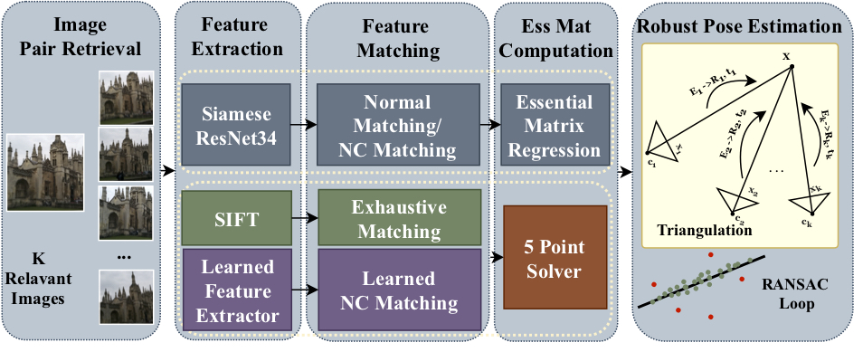

# Visual Localization Via Relative Camera Pose Estimation

This repository provides implementation of  our paper:   To Learn or Not to Learn: Visual Localization from Essential Matrices [TO UPLOAD]



To use our code, first download the repository:
````
git clone git@github.com:GrumpyZhou/visloc-relapose.git
````

## Setup Running Environment
We tested the code on Linux Ubuntu 16.04.6 with following versions:
````
1. Python 3.6 + Pytorch 0.4.0  + CUDA 8.0 + CUDNN 8.0v5.1  (Paper version) 
2. Python 3.6 + Pytorch 0.4.0  + CUDA 10.0 + CUDNN 10.0v7.5.1.10
3. Python 3.7 + Pytorch 1.0  + CUDA 8.0 + CUDNN 8.0v5.1
4. Python 3.7 + Pytorch 1.0  + CUDA 10.0 + CUDNN 10.0v7.5.1.10	(Latest version)
````
We recommend to use *Anaconda* to manage packages. Run following lines to automatically setup a ready environment for our code.
````
conda env create -f environment.yml  # This one installs version 3./4.
conda activte relapose
````
Otherwise, one can try to download all required packages seperately according to their offical documentation.

## Prepare Datasets 
Our code is flexible for evaluation on various localization datasets. We use Cambridge Landmarks dataset as an example to show how to prepare a dataset:
1. Create data/ folder
2. Download original [Cambridge Landmarks Dataset](http://mi.eng.cam.ac.uk/projects/relocalisation/#dataset) and extract it to *\$CAMBRIDGE_DIR\$*.
3. Construct folder structure more convenient for running all scripts in this repo:
	````
	cd visloc-relapose/
	mkdir data
	mkdir data/datasets_original
	cd data/original_datasets
	ln -s $CAMBRIDGE_DIR$ CambridgeLandmarks
	````
4. Download [our pairs](https://vision.in.tum.de/webshare/u/zhouq/visloc-datasets/) for training, validation and testing. About the format of our pairs, check [readme](https://vision.in.tum.de/webshare/u/zhouq/visloc-datasets/README.md). 
5. Place pairs to corresponding folder under *data/datasets_original/CambridgeLandmarks*.
6. Pre-save resized 480 images to speed up data loading time (Optional, but Recommended)
	````
	cd visloc-relapose/
	python -m utils.datasets.resize_dataset \
		--base_dir data/datasets_original/CambridgeLandmarks \ 
		--save_dir=data/datasets_480/CambridgeLandmarks \
		--resize 480  --copy_txt True 
	````
7. Test your setup by visualizing the data using [notebooks/data_loading.ipynb](notebooks/data_loading.ipynb) .
8. (Optional) One can also resize the dataset images so that shorter side has 256 pixels at once makes training faster.
#### 7Scenes Datasets
We follow the camera pose label convention of Cambridge Landmarks dataset.  Similarly, you can download  [our pairs](https://vision.in.tum.de/webshare/u/zhouq/visloc-datasets/)  for 7Scenes. For **other datasets**, contact me for information about preprocessing and pair generation.


##  Feature-based: SIFT + 5-Point Solver

We use the SIFT feature extractor and feature matcher in [colmap](https://colmap.github.io/). One can follow the [installation guide](https://colmap.github.io/install.html) to install colmap. We save colmap outputs in database format, see [explanation](https://colmap.github.io/database.html).

### Preparing SIFT features 
Execute following commands to run SIFT extraction and matching on CambridgeLandmarks:
````
cd visloc-relapose/
bash prepare_colmap_data.sh  CambridgeLandmarks
````
Here CambridgeLandmarks is the folder name that is consistent with the dataset folder. So you can also use other dataset names such as 7Scenes if you have prepared the dataset properly in advance.

### Evaluate SIFT within our pipeline
Example to run sift+5pt on Cambridge Landmarks:
````
python -m pipeline.sift_5pt \
        --data_root 'data/datasets_original/' \
        --dataset 'CambridgeLandmarks' \
        --pair_txt 'test_pairs.5nn.300cm50m.vlad.minmax.txt' \
        --cv_ransac_thres 0.5\
        --loc_ransac_thres 5\
        -odir 'output/sift_5pt'\
        -log 'results.dvlad.minmax.txt'
````
More evaluation examples see: [sift_5pt.sh](sift_5pt.sh). Check [example outputs](https://vision.in.tum.de/webshare/u/zhouq/visloc-relapose/sift_5pt/)
Visualize SIFT correspondences using our notebook[TOADD].
##  Learning-based: Direct Regression via EssNet
The _pipelin.relapose_regressor_ module can be used for  both training or testing our regression networks defined under *networks/*, e.g., EssNet, NCEssNet, RelaPoseNet... We provide training and testing examples in [regression.sh](regression.sh). 
The module allows flexible variations of the setting. For more details about the module options, run `python -m pipeline.relapose_regressor -h`.
### Training
Here we show an example how to train an EssNet model on ShopFacade scene.
````
python -m pipeline.relapose_regressor \
        --gpu 0 -b 16 --train -val 20 --epoch 200 \
        --data_root 'data/datasets_480' -ds 'CambridgeLandmarks' \
        --incl_sces 'ShopFacade' \
        -rs 480 --crop 448 --normalize \
        --ess_proj --network 'EssNet' --with_ess\
        --pair 'train_pairs.30nn.medium.txt' -vpair 'val_pairs.5nn.medium.txt' \
        -lr 0.0001 -wd 0.000001 \
        --odir  'output/regression_models/example' \
        -vp 9333 -vh 'localhost' -venv 'main' -vwin 'example.shopfacade' 
````
This command produces outputs are available online [here](https://vision.in.tum.de/webshare/u/zhouq/visloc-relapose/regression_models/example/). 

#### Visdom (optional)
As you see in the example above, we use [Visdom](https://github.com/facebookresearch/visdom) server to visualize the training process.  One can adapt the meters to plot inside [utils/common/visdom.py](utils/common/visdom.py). By default, previous example gives following plots[TOADD].
If you DON'T want it, just remove the last line `-vp 9333 -vh 'localhost' -venv 'main' -vwin 'example.shopfacade'`.

#### Trained models and weights
We release almost all trained models that are used in our paper. One can download them from [pretrained regression models](https://vision.in.tum.de/webshare/u/zhouq/visloc-relapose/regression_models).
We also provide some [pretrained weights on MegaDepth/ScanNet](https://vision.in.tum.de/webshare/u/zhouq/visloc-relapose/pretrained_weights/). 

### Testing
Here is a piece of code to test the example model above.
````
python -m pipeline.relapose_regressor \
        --gpu 2 -b 16  --test \
        --data_root 'data/datasets_480' -ds 'CambridgeLandmarks' \
        --incl_sces 'ShopFacade' \
        -rs 480 --crop 448 --normalize\
        --ess_proj --network 'EssNet'\
        --pair 'test_pairs.5nn.300cm50m.vlad.minmax.txt'\
        --resume 'output/regression_models/example/ckpt/???' \
        --odir 'output/regression_models/example'
````
This testing code outputs are shown in  [test_results.txt](TODO).
For convenience, we also provide [notebooks/eval_regression_model.ipynb](notebooks/eval_regression_model.ipynb) to perform evaluation.(TODO). Howeve, testing larger dataset such as 7Scenes takes quite some time, so in case notebook stops in the middle, running commands directly is recommended.


## Hybrid: Learnable Matching + 5-Point Solver
In this method, the code of the NCNet is taken from the original implementation [https://github.com/ignacio-rocco/ncnet](https://github.com/ignacio-rocco/ncnet). We use their pre-trained model but we only use the weights for neighbourhood consensus(NC-Matching), i.e., the 4d-conv layer weights.  For convenience, you can download our parsed version [nc_ivd_5ep.pth](https://vision.in.tum.de/webshare/u/zhouq/visloc-relapose/pretrained_weights/nc_ivd_5ep.pth). The models for feature extractor initialization needs to be downloaded from [pretrained regression models](https://vision.in.tum.de/webshare/u/zhouq/visloc-relapose/regression_models).
 in advance, if you want to test them.

### Testing example for  NC-EssNet(7S)+NCM+5Pt (Paper.Tab2)
In this example, we use **NCEssNet** trained on **7Scenes** for 60 epochs to extract features  and use the **pre-trained NC Matching layer** to get the point matches. Finally **5 point solver** calculates the essential matrix. The model is evaluated on **CambridgeLandmarks**. 
````
# 
python -m pipeline.ncmatch_5pt \
    --data_root 'data/datasets_original' \
    --dataset 'CambridgeLandmarks' \
    --pair_txt 'test_pairs.5nn.300cm50m.vlad.minmax.txt' \
    --cv_ransac_thres 4.0\
    --loc_ransac_thres 15\
    --feat 'output/regression_models/448_normalize/nc-essnet/7scenes/checkpoint_60_0.04m_1.62deg.pth'\
    --ncn 'output/pretrained_weights/nc_ivd_5ep.pth' \    
    --posfix 'essncn_7sc_60ep+ncn'\
    --match_save_root 'output/ncmatch_5pt/saved_matches'\
    --ncn_thres 0.9 \
    --gpu 2\
    -o 'output/ncmatch_5pt/loc_results/Cambridge/essncn_7sc_60ep+ncn.txt' 
````

Example outputs is available [here](https://vision.in.tum.de/webshare/u/zhouq/visloc-relapose/ncmatch_5pt/). If you don't want to save intermediate matches extracted, remove option `--match_save_root`.
